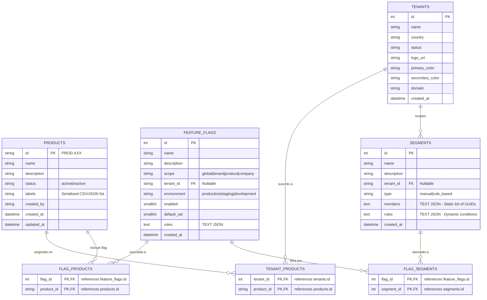

# 📘 PRD INTEGRADO MVP2 — Plataforma BackOffice Multi‑Tenant y Feature Flags
*(Product Requirements Document — Versión Consolidada y Expandida)*

---

## 1. Visión General del Producto

La **Plataforma BackOffice Multi‑Tenant** es un sistema integral de nivel empresarial diseñado para operar en entornos altamente dinámicos y globales. Sus capacidades principales residen en el soporte nativo para:

- **Multi‑tenant**: Aislamiento lógico y gestión de múltiples clientes corporativos (tenants).
- **Multi‑producto**: Habilitación, versionado y control de catálogo de productos independientes y transversales.
- **Multi‑país / Multi‑idioma**: Configuración regional adaptativa a nivel de plataforma, tenant, empresa y usuario.
- **Multi‑whitelabel**: Personalización visual de marca en múltiples niveles jerárquicos (Plataforma → Tenant → Empresa).
- **Feature Flags & Segmentos**: Orquestación granular y en tiempo real de lanzamientos de código y segmentación de usuarios.
- **Observabilidad de SLA/SLO**: Monitoreo proactivo de la salud del sistema y alertas automáticas.

El objetivo de esta versión (MVP2) es introducir el desacoplamiento de la interfaz en una arquitectura de **Micro-UIs (Micro-Frontends)**, consolidar la gestión de **Productos** y **Segmentos** como entidades de base de datos de primer nivel, e introducir el **SDK oficial de Feature Flags** para habilitar la evaluación local/remota de banderas en la propia plataforma y aplicaciones cliente.

---

## 2. Objetivos del Producto

### 2.1 Objetivos Funcionales
- **Ecosistema Multi-Producto**: Centralizar la administración y ciclo de vida de los productos en catálogo y sus suscripciones por tenant.
- **Segmentación Avanzada**: Targetizar grupos de usuarios utilizando cohortes estáticas (manuales) y dinámicas basadas en reglas y variables de contexto en tiempo de ejecución.
- **Consumo Unificado (SDK)**: Proveer una librería integrada (SDK) para evaluar condiciones de Feature Flags con latencia ultra-baja en clientes web y APIs.
- **Modularidad e Independencia**: Permitir que múltiples equipos de desarrollo desplieguen y evolucionen funcionalidades de seguridad, tenants, flags u observabilidad sin interferencias mutuas.

### 2.2 Objetivos Técnicos
- **Desacoplamiento Frontend**: Transicionar del monolito actual en `portal` hacia un **Shell (Portal Host)** que orquesta de forma perezosa **5 Micro-UIs** remotas mediante **Vite Module Federation**.
- **Promoción de Entidades**: Migrar la gestión de productos desde un simple campo de texto JSON en `tenants` hacia una tabla relacional independiente con soporte para tags y control de estado.
- **Evaluación Eficiente de Flags (SDK)**:
  - Evaluación local en memoria (<1ms) mediante bootstrap inicial del estado.
  - Evaluación remota (<50ms) en escenarios donde la privacidad del contexto o la complejidad de las reglas requieran procesamiento en servidor.
  - Sincronización en tiempo real basada en WebSockets o Server-Sent Events (SSE).

---

## 3. Usuarios y Roles

### 3.1 Roles Globales
- **PlatformAdmin**: Administrador supremo del sistema. Gestiona el catálogo global de productos, aprovisionamiento de tenants y parámetros generales.

### 3.2 Roles de Tenant
- **TenantOwner**: Propietario del tenant. Administra la suscripción de productos para su tenant, configura el whitelabel del tenant y asigna administradores.
- **TenantAdmin**: Administrador operativo del tenant. Gestiona usuarios, clientes y configura flags asignadas al tenant.
- **TenantViewer**: Acceso de solo lectura a todos los módulos autorizados del tenant.

### 3.3 Roles de Producto
- **ProductManager**: Administra el catálogo de flags, segmentos de targeting y reglas de asignación asociadas a un producto.
- **ProductDeveloper**: Crea flags técnicas y define las condiciones lógicas de evaluación.
- **ProductQA**: Modifica valores por defecto de flags en ambientes de desarrollo y QA para realizar pruebas de regresión.

### 3.4 Roles de Cliente Empresa
- **CompanyAdmin**: Administrador de la organización B2B cliente del tenant. Controla su propio sub-whitelabel y usuarios internos.
- **CompanyUser**: Usuario de negocio final que consume el producto provisto.

### 3.5 Autenticación y MFA Adaptativo
- **Keycloak** actúa como el Identity Provider (IdP) principal.
- **MFA obligatorio** para roles administrativos y perfiles con privilegios de modificación de reglas en producción.
- Soporte para **WebAuthn / FIDO2 (Biométricos)**, **TOTP (Google Authenticator, Authy)** y códigos OTP como fallback.
- **Autenticación adaptativa**: El sistema exige validación MFA adicional si detecta cambios de dirección IP inusuales o geolocalizaciones imposibles.

---

## 4. Gestión de Tenants

La consola de Tenants permite el aprovisionamiento y auditoría de las cuentas corporativas principales:
- **CRUD de Tenants**: Alta, baja lógica, suspensión y reactivación.
- **Asociación de Productos**: Selección selectiva del catálogo de productos habilitados.
- **Configuración de Marca (Whitelabel Base)**: Carga de logotipo, colores primarios, secundarios, dominio personalizado y tipografía base.
- **Localización por Defecto**: Asignación de país, zona horaria, idioma predeterminado y moneda de facturación.

---

## 5. Gestión de Usuarios por Tenant

Administración del ciclo de vida del personal operativo del tenant:
- **Aprovisionamiento**: Creación de usuarios con sincronización en tiempo real hacia Keycloak.
- **Control de Roles Jerárquicos**: Asignación de roles globales del tenant o granulares por producto.
- **Reset de Seguridad**: Posibilidad de forzar el restablecimiento de contraseñas y dispositivos MFA.
- **Auditoría de Acciones**: Registro histórico persistente de accesos y modificaciones en el perfil del usuario.

---

## 6. Gestión de Clientes (B2B / B2C)

La plataforma soporta dos tipos de identidades de cliente final bajo un tenant:

### 6.1 Clientes B2C (Personas Naturales)
- Datos demográficos, preferencias de localización personalizadas e historial de interacción.

### 6.2 Clientes B2B (Empresas)
- Entidades jurídicas con capacidad de autogestión de su branding.
- **Doble Whitelabel**: Capacidad de sobreescribir colores, logotipos y dominios provistos originalmente por el tenant.
- **Localización Exclusiva**: Moneda, formatos y zonas horarias específicas para su región.
- **Etiquetas y Mensajería**: Personalización de alertas de correo y notificaciones en pantalla.

---

## 7. Doble Whitelabel (Tenant + Empresa)

La personalización de la interfaz se calcula de forma jerárquica y en cascada:

```
Plataforma (Defectos) ──> Tenant (Estilos Base) ──> Empresa B2B (Sobreescritura) ──> Preferencias del Usuario (Dark/Light)
```

- **Variables Dinámicas**: El frontend carga un archivo de estilos inyectado dinámicamente según el contexto del dominio o tenant detectado.
- **Elementos Personalizables**: Logotipos (caballete y sidebar), paleta de colores (Primary, Secondary, Accent, Background), fuentes de Google Fonts, y textos de soporte en pie de página.

---

## 8. Localización Avanzada

La localización rige formatos, unidades y mensajes de la plataforma:
- **Idiomas**: Traducciones estructuradas cargadas dinámicamente desde el Backend.
- **Monedas y Unidades**: Conversión visual de datos monetarios y del sistema internacional/inglés.
- **Formatos**: Representación de fechas, horas y separadores numéricos.
- **Prevalencia**: La configuración establecida a nivel de Cliente Empresa tiene prioridad sobre la del Tenant, y esta a su vez sobre el estándar global de la plataforma.

---

## 9. Feature Flags Jerárquicos y Segmentos

### 9.1 Niveles de Feature Flags
Las banderas de funcionalidad se evalúan basándose en una prioridad en cascada de cuatro niveles para permitir un control granular del rollout:

1. **Empresa (Máxima prioridad)**: Banderas personalizadas para clientes B2B específicos.
2. **Producto**: Reglas que se aplican transversalmente a un módulo del sistema.
3. **Tenant**: Configuraciones que habilitan/deshabilitan características para organizaciones enteras.
4. **Global (Mínima prioridad)**: Valores por defecto del sistema para toda la plataforma.

### 9.2 Reglas de Evaluación
Las reglas lógicas se estructuran en formato JSON y admiten operadores avanzados:
- `equals` / `notEquals`: Comparación exacta.
- `in` / `notIn`: Pertenencia a un array de valores.
- `contains` / `notContains`: Coincidencia parcial de strings.
- `regex`: Validación por expresión regular.
- `rollout porcentual`: Distribución determinista de usuarios (0-100%) utilizando hashing de la clave del usuario (`user_id` + `flag_key`).

### 9.3 Segmentación de Usuarios (Segmentos)
Los segmentos permiten agrupar audiencias de forma lógica y reutilizable entre múltiples flags.

#### Tipos de Segmentos:
- **Segmentos Manuales (Estáticos)**: Cohortes compuestas por una lista explícita de identificadores de usuario (`members` en base de datos). Útiles para pruebas internas, betatesters seleccionados o clientes de acceso anticipado.
- **Segmentos Basados en Reglas (Dinámicos)**: Cohortes calculadas dinámicamente evaluando variables del contexto del usuario en tiempo de ejecución (ej. `LTV > 500`, `country == 'US'`, `created_at < 2026-01-01`).

#### Gestión Visual y Métricas (Dashboard):
- **Asociaciones de Flags**: Visualización en tiempo real del número de flags que referencian al segmento, impidiendo la eliminación accidental de segmentos activos.
- **Alerta de Segmentos Huérfanos**: Identificación en el dashboard de aquellos segmentos sin ninguna asociación a feature flags para sugerir su limpieza y optimizar memoria.
- **Tendencias e Insights**: Telemetría integrada para mostrar el porcentaje de hits de cada segmento en producción durante las últimas 24 horas.

---

## 10. Rule Builder

El constructor visual de reglas permite a perfiles no técnicos (Product Managers, Operaciones) definir lógicas complejas sin programar:
- **Interfaz Drag-and-Drop**: Reordenar la prioridad de ejecución de las reglas para una feature flag específica.
- **Simulador de Evaluación**: Sandbox interactivo donde el usuario ingresa un JSON de contexto y el sistema simula la resolución final, indicando qué regla se aplicó, si se cumple el targeting y el valor resultante.
- **Previsualización de Impacto**: Muestra un estimado de cuántos usuarios activos del tenant cumplen con las reglas diseñadas antes de aplicar a producción.

---

## 11. Gestión de Productos (Nueva Entidad del Sistema)

Para escalar la plataforma y permitir integraciones dinámicas de facturación e inventario, la entidad **Producto** se desvincula del campo JSON de `tenants` y se convierte en una **entidad de base de datos de primer nivel**.

### 11.1 Atributos de la Entidad Producto
Cada registro en la tabla `products` cuenta con la siguiente estructura:
- `id`: Identificador alfanumérico único (ej: `PROD-102` o `premium-banking-suite`).
- `name`: Nombre descriptivo del producto (ej: `Premium Banking Suite`).
- `description`: Resumen técnico o comercial de su funcionalidad.
- `status`: Estado operativo (`active` / `inactive`). Un producto inactivo desactiva automáticamente sus rutas y flags asociadas.
- `labels / tags`: Lista de etiquetas para catalogación y filtrado dinámico (ej: `['ENTERPRISE', 'B2C', 'FINANCE']`).
- `created_at`: Fecha y hora de creación de la entidad.
- `created_by`: Identificador del usuario creador (PlatformAdmin).
- `updated_at`: Fecha y hora de la última modificación.

### 11.2 Relaciones de Productos
- **Con Tenants (Many-to-Many)**: Un producto puede estar habilitado para múltiples tenants y un tenant puede suscribir múltiples productos. Esta relación se gestiona mediante la tabla intermedia `tenant_products`. 
  - *Caso Especial*: Si un producto no tiene asociaciones en `tenant_products`, puede marcarse como **Global** (visible para todos por defecto) o **Interno/Aislado** según la configuración.
- **Con Feature Flags (Many-to-Many)**: Las feature flags pueden vincularse a uno o más productos a través de la tabla `flag_products`. Las flags no son exclusivas de un solo producto, permitiendo la existencia de flags transversales (ej: `maintenance-mode` compartida por múltiples suites).

### 11.3 Capacidades del Módulo en el BackOffice
- **Panel de Control de Productos**: Búsqueda avanzada y filtrado combinando estados y etiquetas.
- **Dashboard de Actividad del Producto**: Visualización de los últimos cambios de configuración (Log de auditoría propio), recuento de flags y lista de tenants activos utilizando el producto.
- **Sincronización de Versión CI/CD**: Integración con pipelines de despliegue mediante una API que actualiza el build metadata (ej: `v2.4.12-build.88`) del producto de forma automática.

---

## 12. Observabilidad, SLA y SLO

Monitoreo continuo de la salud operacional de los servicios de la plataforma:
- **Servicios Monitoreados**: API Backend (Python), BFF (Node.js), Base de Datos (PostgreSQL/MySQL), Keycloak, y pasarelas de pago.
- **Health Checks Activos**: Verificación de conectividad en intervalos de 15 segundos.
- **SLA / SLO**: 
  - SLO de latencia: 95% de peticiones evaluadas localmente en <1ms y remotas en <50ms.
  - SLO de Uptime: Disponibilidad del servicio de feature flags de un 99.9%.
- **Degradación y Alertas**: Disparador de notificaciones visuales y vía webhooks ante latencia p99 elevada o tasas de error de API superiores al 1%.

---

## 13. Seguridad y Zero Trust

- **Zero Trust**: Cada llamada a la API debe estar firmada y autenticada; no se asume confianza por red interna.
- **MFA Forzado**: Exigido para cualquier cambio de configuración en ambientes de producción.
- **Logs de Auditoría Inmutables**: Registro de quién, cuándo y qué se modificó. El payload de auditoría se guarda en base de datos y se exporta a sistemas SIEM.

---

## 14. Requerimientos No Funcionales

- **Escalabilidad**: El motor de evaluación en Backend debe ser *stateless* para permitir escalado horizontal ágil bajo picos de carga de eventos de SDK.
- **Rendimiento de Caché**: BFF y SDKs deben almacenar localmente las configuraciones de flags con políticas de invalidación eficientes para cumplir los tiempos de respuesta.
- **Seguridad de Datos**: Cumplimiento normativo GDPR en la gestión de segmentos; las listas de UUIDs o correos deben almacenarse encriptadas en reposo.

---

## 15. Modelo de Permisos Jerárquico

| Rol | Alcance | Permisos |
| :--- | :--- | :--- |
| **PlatformAdmin** | Global | CRUD de tenants, CRUD de productos del catálogo, asignación global de flags. |
| **TenantOwner** | Tenant | Suscribir/dar de baja productos en el tenant, modificar whitelabel base, CRUD de usuarios. |
| **TenantAdmin** | Tenant | CRUD de usuarios internos, configurar flags del tenant, CRUD de clientes locales. |
| **TenantViewer** | Tenant | Lectura de configuraciones, visualización de dashboards de observabilidad y auditoría. |
| **ProductManager** | Producto | Crear flags asociadas a su producto, gestionar segmentos del producto, editar reglas. |
| **ProductDeveloper**| Producto | Crear flags técnicas, probar reglas en QA/Dev, depurar telemetría del SDK. |
| **ProductQA** | Producto | Habilitar/deshabilitar flags exclusivamente en entornos no productivos (`dev`, `qa`). |
| **CompanyAdmin** | Empresa B2B | Administrar usuarios de la empresa, sobreescribir branding del whitelabel secundario. |
| **CompanyUser** | Empresa B2B | Consumo final de productos y visualización según flags activas. |

---

## 16. Arquitectura del Frontend: Desacoplamiento en Micro-UIs

Para asegurar un desarrollo ágil y despliegues independientes sin generar un código monolítico pesado, el frontend se estructura bajo un esquema de **Micro-Frontends** mediante **Vite Module Federation**.

```
                           ┌────────────────────────┐
                           │      Portal Shell      │  (Host - Vue 3)
                           └───────────┬────────────┘
                                       │
            ┌──────────────────┼────────┬──────────────────┐
            ▼                  ▼        ▼                  ▼
    ┌──────────────┐   ┌─────────────┐ ┌────────────────┐ ┌──────────────────┐
    │ mui-security │   │ mui-tenants │ │ mui-feat-flags │ │ mui-observability│ ... (Remotos)
    └──────────────┘   └─────────────┘ └────────────────┘ └──────────────────┘
```

### 16.1 Portal Shell (El Orquestador)
El proyecto `portal` actúa únicamente como el Host ligero de la aplicación. No implementa vistas de negocio ni lógica de dominio específica. Sus tareas exclusivas son:
- **Autenticación e Identidad**: Inicializa el SDK de Keycloak, gestiona el flujo PKCE y refresca los tokens JWT.
- **Estructura Visual Común (Layout)**: Renderiza el header, el sidebar drawer de navegación y los pies de página comunes. Implementa el control global de tema oscuro/claro inyectando clases Tailwind en el elemento `<html>`.
- **Orquestación de Enrutamiento**: Carga de forma perezosa (Lazy Loading) e inyecta dinámicamente las rutas expuestas por cada una de las Micro-UIs remotas.
- **Servicios Transversales**: Instancia única de Pinia para estado compartido, bus de notificaciones ToastStore y cliente HTTP Axios centralizado con interceptores automáticos de autenticación.

### 16.2 Agrupación de Micro-UIs (Remotos)
1. **`mui-security` (Identidad y Accesos)**: CRUD de usuarios del tenant, asignación de roles jerárquicos y configuraciones de restablecimiento de MFA.
2. **`mui-tenants` (Organizaciones)**: Consola de control de Tenants para los PlatformAdmins (creación, edición y asignación de productos).
3. **`mui-feature-flags` (Lanzamientos)**: Constructor de reglas drag-and-drop, gestión de flags y editor de segmentos dinámicos/manuales.
4. **`mui-clients` (Clientes y Localización)**: CRUD de clientes corporativos, editor visual de Doble Whitelabel y perfiles de internacionalización.
5. **`mui-observability` (Métricas y SLAs)**: Dashboard con métricas de salud en tiempo real, latencias y alertas de SLO.

---

## 17. Feature Flag SDK (Nuevo Componente)

El **Feature Flag SDK** es la biblioteca oficial que permite a los sistemas del backend y frontend evaluar el estado de las flags de forma rápida y segura.

### 17.1 Especificaciones Técnicas del SDK
El SDK se implementa en dos variantes de lenguaje:
- **SDK Cliente (JavaScript/TypeScript)**: Diseñado para Single Page Applications (SPAs) y micro-frontends en el navegador.
- **SDK Servidor (Python)**: Diseñado para integrarse en servicios backend (FastAPI/BFF) de forma asíncrona.

### 17.2 Modos de Evaluación
- **Evaluación Local (Caché en Memoria)**: El SDK se conecta a la API de bootstrap al inicializar, descargando la configuración completa de las flags del tenant/producto. Las evaluaciones posteriores son instantáneas (<1ms) y no realizan llamadas de red secundarias.
- **Evaluación Remota**: Utilizada en flujos críticos del backend donde el contexto del usuario es altamente confidencial o las reglas lógicas requieren consultas pesadas de bases de datos. La evaluación se delega directamente a la API `/api/evaluate` del BFF.

### 17.3 Sincronización en Tiempo Real
- **WebSocket Gateway**: El SDK abre un canal bidireccional permanente con el WebSocket Hub del Backend. Ante cualquier modificación o guardado de flags en el BackOffice, se envía una notificación de invalidación de caché, forzando al SDK a recargar el bootstrap sin reiniciar la aplicación.

### 17.4 Telemetría y Reporting
- Para no penalizar la red, el SDK almacena en memoria los contadores de evaluación de cada flag.
- Cada 60 segundos (o al acumular 100 eventos), el SDK realiza un envío en batch de telemetría a `/api/v1/sdk/eval-events`, alimentando el dashboard de observabilidad y métricas de SLAs.

---

## 18. Modelo de Datos (Esquema Actualizado)

El modelo de datos se adapta para soportar la entidad **Products** independiente y la diferenciación de tipos en **Segments**:



---

## 19. Interface Control Document (ICD) — Nuevos Endpoints

### 19.1 Endpoints de Gestión de Productos
- **`GET /bff/products`**: Listar catálogo de productos con soporte para filtros por estado y etiquetas.
- **`POST /bff/products`**: Registrar un nuevo producto en catálogo.
- **`PUT /bff/products/{id}`**: Actualizar metadatos y estado del producto.
- **`POST /bff/tenant/{id}/products`**: Suscribir a un tenant a un conjunto de productos.
- **`PUT /bff/products/{id}/version`**: Actualizar la versión activa del producto (CI/CD sync).

### 19.2 Endpoints del SDK de Feature Flags
- **`GET /api/v1/sdk/bootstrap`**: Obtener configuración consolidada de flags de un Tenant y Producto específico.
  - *Query Params*: `tenant_id`, `product_id`, `environment`.
- **`POST /api/v1/sdk/evaluate`**: Evaluar remotamente una bandera enviando un contexto dinámico.
  - *Payload*: `{"flag_key": "premium-feature", "context": {"user_id": "123", "country": "US", "ltv": 600}}`
- **`POST /api/v1/sdk/eval-events`**: Endpoint de ingesta masiva de eventos de telemetría de evaluación de flags.

---

## 20. Ejemplo de Integración del SDK

### 20.1 Ejemplo en JavaScript / TypeScript (Client-Side)
```typescript
import { StitchFlagsClient } from '@stitch/flags-sdk-js';

// Inicialización del cliente con sincronización local e invalidación WebSocket
const flagsClient = new StitchFlagsClient({
  bootstrapUrl: 'https://backoffice.stitch.io/api/v1/sdk/bootstrap',
  tenantId: 'tenant-citibank-us',
  productId: 'premium-banking-suite',
  environment: 'production',
  enableRealTime: true // Activa conexión WebSocket
});

await flagsClient.initialize();

// Evaluación instantánea en memoria (<1ms)
const context = { userId: 'usr-90812', country: 'US', ltv: 650 };
const isEligible = flagsClient.evaluate('show-new-dashboard', context);

if (isEligible) {
  renderNewDashboard();
} else {
  renderLegacyDashboard();
}
```

### 20.2 Ejemplo en Python (Server-Side)
```python
from stitch_flags_sdk import StitchFlagsClient

# Inicialización del SDK de servidor en segundo plano
flags_client = StitchFlagsClient(
    bootstrap_url="http://backend:8000/api/v1/sdk/bootstrap",
    tenant_id="tenant-citibank-us",
    product_id="premium-banking-suite",
    environment="production"
)

async def handle_user_request(user_data: dict):
    context = {
        "userId": user_data["id"],
        "country": user_data["country"],
        "ltv": user_data["lifetime_value"]
    }
    
    # Evaluación local ultra-rápida utilizando caché local actualizado
    if await flags_client.evaluate_async("double-factor-authentication-v2", context):
        return await trigger_mfa_flow()
    return await normal_login_flow()
```

---

## 21. Roadmap Expandido

### Fase 1: Core de la Plataforma (Completado/Fase Inicial)
- Modelo de base de datos base y login SSO con Keycloak.
- Banderas de funcionalidad globales y asignación por tenant.

### Fase 2: Modularidad, Productos y Segmentación Avanzada (MVP2 - Fase Actual)
- Refactorización del frontend a arquitectura de Shell + Micro-UIs.
- Migración de la entidad de Productos a base relacional independiente.
- Segmentos Manuales y Dinámicos basados en reglas de targeting.
- Lanzamiento de los SDKs oficiales de Feature Flags para JS/TS y Python.

### Fase 3: Observabilidad y Automatización de Ciclo de Vida
- Dashboards de métricas SLA/SLOs y estado de salud.
- Conector de CI/CD para actualización automática de versiones de productos.
- Reporte detallado de hits e impacto de flags en producción.

### Fase 4: Seguridad y MFA Adaptativo
- Políticas de MFA basadas en geolocalización o anomalías de acceso.
- Limpieza automática de segmentos huérfanos e integraciones externas.

---

## 22. Glosario de Términos

- **Vite Module Federation**: Tecnología que permite compilar múltiples aplicaciones web independientes y cargarlas dinámicamente en una aplicación Host en tiempo de ejecución.
- **Dynamic Segment**: Grupo de usuarios que cumplen ciertas condiciones lógicas evaluadas al momento de solicitar una flag.
- **Orphan Segment**: Segmento de usuarios existente en la base de datos que no está referenciado por ninguna feature flag activa.
- **SDK Bootstrap**: Proceso mediante el cual el SDK descarga la totalidad de las reglas de feature flags al arrancar, evitando llamadas posteriores al servidor.
- **Hashing de Rollout**: Técnica matemática para dividir porcentajes de usuarios de forma determinista y consistente (un usuario específico siempre verá la misma versión de la flag si el porcentaje no cambia).
