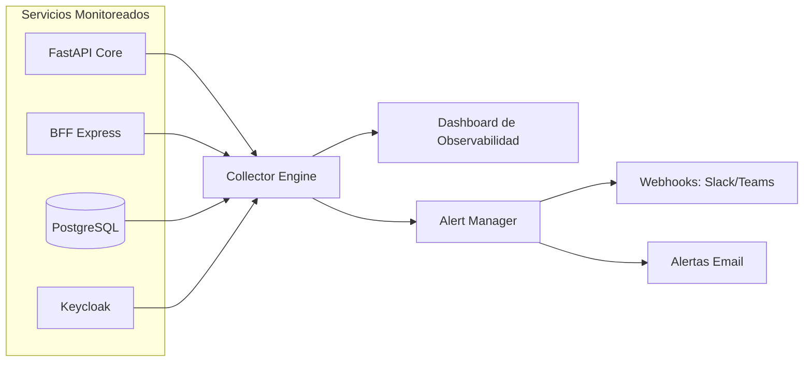
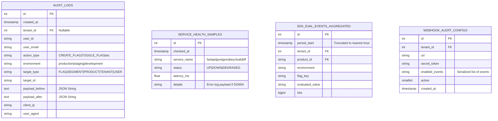

# 📘 PRD INTEGRADO MVP3 — Observabilidad, Ingesta de Telemetría y Auditoría Avanzada
*(Product Requirements Document — Versión Consolidada y Expandida para MVP3)*

---

## 1. Visión General del Producto

La **Plataforma BackOffice Multi‑Tenant** (Stitch Console) en su tercera fase (**MVP3**) se enfoca en dotar a las organizaciones de capacidades robustas de **Observabilidad**, **Ingesta de Telemetría en Tiempo Real** de Feature Flags, y un sistema de **Auditoría Avanzada con Timeline y Control de Cambios**.

El objetivo de esta versión es cerrar la brecha operativa permitiendo a los administradores y product managers monitorear de manera precisa la salud de los servicios, el cumplimiento de los **SLAs/SLOs** de evaluación de banderas, el impacto real de las configuraciones en producción (mediante el procesamiento de telemetría de uso) y garantizar un registro inmutable y visual de quién cambió qué (log de auditoría con visor de diferencias/diffs).

---

## 2. Objetivos del Producto

### 2.1 Objetivos Funcionales
- **Monitoreo de SLAs y SLOs**: Proveer un panel de control unificado que permita visualizar la disponibilidad (Uptime) y el rendimiento (latencias p95/p99) de los servicios clave del sistema.
- **Ingesta Masiva de Telemetría**: Procesar eficientemente los eventos agregados de evaluación que envían los SDKs de Feature Flags (`eval-events`), permitiendo visualizar estadísticas de hits de cada bandera.
- **Auditoría Visual Dinámica**: Implementar una bitácora de actividad (Audit Log) interactiva en formato timeline con filtros combinados (Environment, Action Type, User, Date Range) y visualización detallada de diferencias (View Diff).
- **Alertas Proactivas**: Disparar notificaciones automáticas vía webhooks (ej. Slack, Teams) y correo electrónico ante la degradación de un servicio o el incumplimiento de un SLO.

### 2.2 Objetivos Técnicos
- **Pipeline de Ingesta Asíncrono (SDK Telemetry)**: Diseñar un mecanismo de ingesta de eventos de evaluación altamente concurrente capaz de recibir y consolidar miles de eventos por segundo sin degradar la latencia de base de datos.
- **Invalidación de Caché Distribuida con Redis Pub/Sub**: Soportar el escalado horizontal del Backend (FastAPI stateless). Cuando se modifica una Feature Flag en el BackOffice, un mensaje en Redis Pub/Sub notifica a todas las instancias del backend para que actualicen sus conexiones WebSockets con los SDKs clientes.
- **Motor de Diffs JSON**: Implementar lógica para calcular y almacenar el delta (antes vs. después) de los cambios en Feature Flags, Segmentos y Ajustes de Tenants, presentándolo visualmente en el frontend.
- **Health Checker Engine**: Agente de verificación activa integrado en el backend que sondea la conectividad de los componentes internos y externos cada 15 segundos de forma no bloqueante.

---

## 3. Usuarios y Roles (Nuevas Capacidades)

En MVP3, los roles existentes adquieren permisos y vistas orientadas al control de calidad y auditoría:

- **PlatformAdmin**:
  - Acceso completo al dashboard de salud global (infraestructura) y métricas transversales de SLAs.
  - Configuración global de los umbrales de alerta de SLOs para toda la plataforma.
- **TenantOwner / TenantAdmin**:
  - Visualización del timeline completo de auditoría de su Tenant.
  - Configuración de alertas y webhooks locales de su organización (ej. recibir alertas de cambios en producción en su canal corporativo de Slack).
- **ProductManager / ProductDeveloper**:
  - Acceso a estadísticas de hits y telemetría de evaluación de las Feature Flags asociadas a sus productos.
  - Consulta de logs de auditoría técnica filtrados por producto para analizar cambios históricos.
- **ProductQA**:
  - Consulta del log de auditoría para validar despliegues y cambios en entornos de desarrollo y QA.

---

## 4. Módulo de Observabilidad, SLAs y SLOs

Monitoreo continuo del estado de salud y rendimiento del ecosistema Stitch:

### 4.1 Componentes Monitoreados
- **APIs Internas**: FastAPI Core Backend.
- **BFF (Gateway)**: Latencias y códigos de estado HTTP transferidos.
- **Base de Datos**: Tiempos de query en PostgreSQL y pool de conexiones.
- **Keycloak**: Latencia en autenticación SSO.
- **WebSocket Gateway**: Cantidad de conexiones activas por tenant y producto.

### 4.2 Indicadores Clave de Rendimiento (SLIs)
- **Uptime de Evaluación**: % de tiempo en el que la API del SDK responde exitosamente.
- **Latencia de Evaluación Local (SDK)**: Mantenimiento del SLO de latencia en memoria ($<1\text{ms}$).
- **Latencia de Evaluación Remota**: Tiempo de procesamiento del endpoint `/api/evaluate` ($<50\text{ms}$).
- **Error Rate**: % de peticiones de evaluación o bootstrap fallidas.



---

## 5. Ingesta Masiva de Telemetría (SDK Eval Events)

Para alimentar las estadísticas de impacto de cada Feature Flag sin degradar el rendimiento del backend principal, se define el siguiente pipeline de telemetría:

1. **Agregación en SDK**: El SDK en el cliente acumula contadores en memoria:
   `flag_key`, `value_evaluated`, `count_hits`, `environment`.
2. **Batch Ingestion**: Cada 60 segundos o al alcanzar 100 eventos, el SDK hace `POST` al endpoint `/api/v1/sdk/eval-events`.
3. **Buffer Asíncrono / Cola**: El backend procesa las solicitudes de eventos y los inserta en una base de datos de series de tiempo o tabla intermedia optimizada para inserción rápida.
4. **Agregador por Hora/Día**: Un proceso en segundo plano (Worker/Task) consolida estos registros agregándolos por hora y eliminando los logs detallados viejos para optimizar almacenamiento.

---

## 6. Sistema de Auditoría y Timeline Avanzado

Implementación de la bitácora unificada mostrada en la maqueta [audit-log_activity-timeline.html](file:///c:/Users/ianache/Desktop/DATA/01-DOCUMENTOS/02-PROYECTOS/107-BackOffice/design/stitch/audit-log_activity-timeline.html).

### 6.1 Atributos del Audit Log
Cada cambio relevante de configuración genera un registro inmutable:
- `id`: Identificador único.
- `timestamp`: Fecha y hora UTC del cambio.
- `tenant_id`: Asignación del inquilino correspondiente (si aplica).
- `user_id` / `user_email`: Identidad de la persona que realizó la acción.
- `action_type`: Tipo de acción (`CREATE_FLAG`, `TOGGLE_FLAG`, `UPDATE_RULES`, `DELETE_SEGMENT`, `UPDATE_WHITELABEL`, etc.).
- `environment`: `production`, `staging` o `development`.
- `target_type`: Entidad afectada (`FLAG`, `SEGMENT`, `PRODUCT`, `TENANT`, `USER`).
- `target_id`: ID de la entidad afectada.
- `payload_before`: Estado de la entidad en formato JSON antes del cambio.
- `payload_after`: Estado de la entidad en formato JSON después del cambio.
- `client_ip` / `user_agent`: Origen de la petición.

### 6.2 Visualización de Diferencias (View Diff)
Al pulsar "View Diff" en el Timeline de Auditoría, se despliega una interfaz que resalta los cambios lógicos del JSON de configuración (usando verde para adiciones, rojo para eliminaciones y amarillo para modificaciones), permitiendo a los usuarios entender rápidamente qué regla o flag fue alterada.

---

## 7. Escalabilidad y WebSocket Gateway con Redis Pub/Sub

Para soportar la sincronización en tiempo real de miles de clientes SDK distribuidos de forma global, se implementa una arquitectura basada en comunicación distribuida:

```
                  ┌──────────────────────────────┐
                  │       Stitch Console         │ (Modifica Flag)
                  └──────────────┬───────────────┘
                                 │
                                 ▼
                     ┌──────────────────────┐
                     │ FastAPI Server #1    │ (Escribe en DB)
                     └───────────┬──────────┘
                                 │
                                 ▼ (Publica en Redis)
                          ((  REDIS  ))  (Pub/Sub Channel: 'flag-updates')
                                 │
                 ┌───────────────┴───────────────┐
                 ▼ (Suscrito)                    ▼ (Suscrito)
     ┌──────────────────────┐        ┌──────────────────────┐
     │ FastAPI Server #1    │        │ FastAPI Server #2    │
     └───────────┬──────────┘        └───────────┬──────────┘
                 │ (Notifica WebSocket)          │ (Notifica WebSocket)
                 ▼                               ▼
          ┌──────────────┐                ┌──────────────┐
          │ SDK Client A │                │ SDK Client B │
          └──────────────┘                └──────────────┘
```

1. **Modificación**: Un usuario del portal actualiza una flag en el servidor FastAPI #1.
2. **Publicación**: FastAPI #1 guarda en la base de datos y publica un mensaje en el canal Redis Pub/Sub `flag-updates` con el payload: `{"tenant_id": "T1", "product_id": "P1", "environment": "prod"}`.
3. **Distribución**: Todas las instancias activas de FastAPI (#1, #2, #N) que escuchan el canal de Redis reciben el aviso.
4. **Notificación**: Cada instancia FastAPI busca en su administrador de conexiones de WebSockets (`ConnectionManager`) los clientes SDK conectados a ese `tenant_id` y `product_id`, enviándoles una señal ligera de invalidación de caché (`{"event": "invalidate"}`).
5. **Fetch**: Los clientes SDK descargan el nuevo bootstrap asíncronamente en una sola petición HTTP, actualizando la caché local.

---

## 8. Interface Control Document (ICD) — Nuevos Endpoints MVP3

### 8.1 Endpoints de Observabilidad y SLAs
- **`GET /bff/health/services`**: Obtener estado detallado de salud de los componentes (FastAPI, DB, Keycloak, etc.) con sus latencias de respuesta.
- **`GET /bff/observability/metrics`**: Obtener el historial agregados de latencias (p95, p99) y ratios de error.
  - *Query Params*: `tenant_id`, `range` (24h, 7d, 30d).
- **`POST /bff/observability/webhooks`**: CRUD de configuraciones de Webhooks del tenant para alertas.

### 8.2 Endpoints de Telemetría (Ingesta del SDK)
- **`POST /api/v1/sdk/eval-events`**: Ingesta masiva de eventos agregados de evaluación.
  - *Payload*: 
    ```json
    {
      "tenant_id": "citibank-us",
      "product_id": "premium-banking",
      "environment": "production",
      "timestamp": "2026-06-12T22:30:00Z",
      "evaluations": [
        { "flag_key": "show-new-dashboard", "value": true, "hits": 1250 },
        { "flag_key": "show-new-dashboard", "value": false, "hits": 75 },
        { "flag_key": "mfa-v2", "value": false, "hits": 1325 }
      ]
    }
    ```

### 8.3 Endpoints del Log de Auditoría
- **`GET /bff/audit-logs`**: Listar el historial de auditoría del tenant.
  - *Query Params*: `environment`, `action_type`, `user_id`, `start_date`, `end_date`, `page`, `limit`.
- **`GET /bff/audit-logs/{id}/diff`**: Obtener el diff detallado (comparación de `payload_before` y `payload_after`) del cambio.

---

## 9. Modelo de Datos (Tablas Adicionales MVP3)

Para soportar las necesidades de observabilidad, ingesta de telemetría y auditoría avanzada, se incorporan las siguientes tablas al modelo relacional:



---

## 10. Requerimientos No Funcionales MVP3

### 10.1 Rendimiento e Ingesta
- El endpoint `/api/v1/sdk/eval-events` debe responder en menos de $10\text{ms}$ (devolviendo `202 Accepted` de inmediato) tras almacenar el payload en memoria o cola asíncrona, liberando la conexión del cliente velozmente.
- Las consultas del Timeline de Auditoría en [audit-log_activity-timeline.html](file:///c:/Users/ianache/Desktop/DATA/01-DOCUMENTOS/02-PROYECTOS/107-BackOffice/design/stitch/audit-log_activity-timeline.html) deben cargarse con paginación optimizada para garantizar respuestas en menos de $150\text{ms}$ sobre millones de registros históricos.

### 10.2 Fiabilidad y Resiliencia
- La caída temporal del sistema de recolección de métricas o telemetría no debe impedir bajo ningún concepto que los clientes evalúen Feature Flags (resiliencia del Core de evaluación frente a fallos de observabilidad).
- Los logs de auditoría deben almacenarse con políticas de restricción de escritura/edición (Inmutabilidad lógica a nivel de aplicación) para cumplir normativas de cumplimiento corporativo.

---

## 11. Glosario de Términos MVP3

- **SLA (Service Level Agreement)**: Acuerdo formal que define el nivel de servicio esperado de cara al cliente (ej. disponibilidad del 99.9%).
- **SLO (Service Level Objective)**: Objetivos de rendimiento internos específicos medidos a través de SLIs (ej. 95% de las llamadas de API deben completarse en menos de 50ms).
- **SLI (Service Level Indicator)**: Métrica cuantitativa que mide el rendimiento real de un servicio (ej. tiempo de respuesta exacto).
- **Redis Pub/Sub**: Patrón de mensajería asíncrona mediante publicación/suscripción para la comunicación instantánea y ligera entre servidores stateless.
- **View Diff**: Representación visual de diferencias lógicas de configuración entre dos estados JSON en el tiempo.
- **Batching**: Agrupación de múltiples eventos individuales para enviarse de forma masiva en una sola petición, optimizando la latencia de red y carga en servidor.
