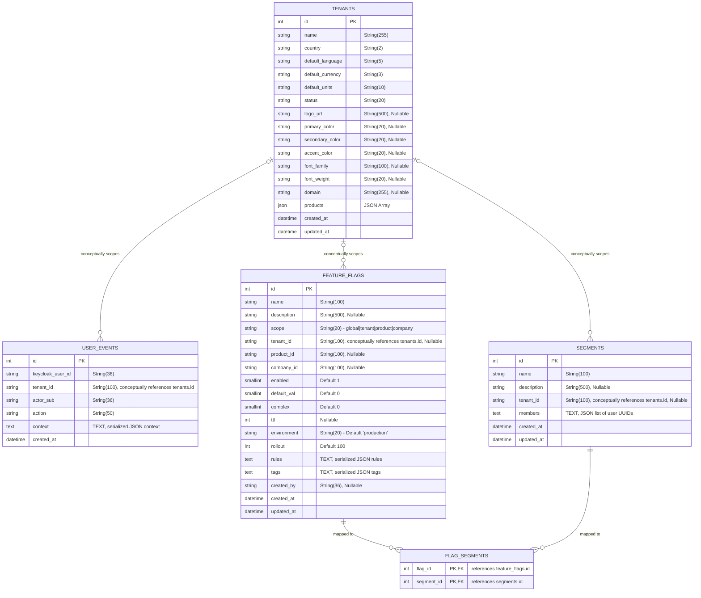

# Data Model Diagram

The solution uses a relational database schema (MySQL) to store tenant configurations, audit events, segments, and feature flags. The ER diagram below represents the tables, column types, keys, and their relationships.

---

## Table Descriptions

### 1. `tenants`
Stores corporate accounts, active modules (products), localizations (ISO-3166-1 country, ISO-639-1 language, ISO-4217 currency, standard units), and customized white-label branding configurations.

### 2. `user_events`
Stores security audit logs. Captures user lifecycle events (creation, profile updates, status toggles, MFA resets) within a tenant. The context details (like which roles were added/removed) are stored as JSON serialized text to remain compatible with MySQL 5.6.

### 3. `feature_flags`
Stores configurations for feature toggles. Toggles can be scoped globally, by tenant, by product, or by company. Includes progression rollout percentages, complex activation rules, environments, and Time-To-Live (TTL).

### 4. `segments`
Stores user groups/cohorts for targeting. Represents a static cohort of user UUIDs (stored in the `members` text field) scoped under a tenant.

### 5. `flag_segments`
Junction table implementing a Many-to-Many association between `feature_flags` and targeting `segments`.
