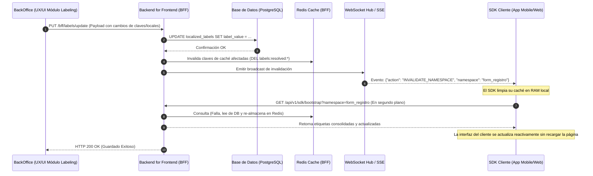

# PRD — Gestor de Namespaces y Claves de Etiquetado (Namespaces & Keys Management)
**Módulo de Localización y Marca Blanca (White Labeling Engine)**

---

## 1. Control de Versiones

| Versión | Fecha | Autor | Descripción | Estado |
| :--- | :--- | :--- | :--- | :--- |
| v1.0.0 | 2026-06-13 | Antigravity AI | Definición inicial de requerimientos funcionales y técnicos para el BackOffice. | Borrador |
| v1.1.0 | 2026-06-13 | Antigravity AI | Refinación del PRD alineado al diseño e interactividad del prototipo HTML (`labeling - namespaces_keys_management.html`). | Consolidado |

---

## 2. Visión General del Módulo

El **Gestor de Namespaces y Claves** es la interfaz administrativa del BackOffice de la plataforma diseñada para que administradores de plataforma (`PlatformAdmin`), administradores de inquilinos (`TenantAdmin`), administradores de producto (`ProductManager`) y redactores de contenido (`UX Writers`) puedan definir, organizar, traducir y sobrescribir las cadenas de texto (etiquetas, placeholders, mensajes de error y validaciones) consumidas por las aplicaciones cliente y las APIs.

Este gestor interactúa directamente con el **Motor de Localización Jerárquico** (White Labeling Engine), permitiendo administrar la base de traducciones y configurar las reglas de sobrescritura en cascada (Tenant → Compañía → Producto).

### 2.1 Jerarquía de Resolución de Etiquetas
Para contextualizar, la resolución en runtime sigue el principio de "Sobrescritura por Cercanía":

```
[Producto (Nivel 3)] ──(Si no existe)──> [Compañía (Nivel 2)] ──(Si no existe)──> [Tenant (Nivel 1)] ──(Si no existe)──> [Technical ID Fallback]
```

---

## 3. Objetivos del Módulo

### 3.1 Objetivos Funcionales
- **Estructuración en Namespaces**: Crear, actualizar y eliminar namespaces para agrupar etiquetas de forma lógica y configurar su estrategia de carga (Eager/Lazy Loading).
- **Gestión Unificada de Claves (Keys)**: Proveer una matriz de traducción para crear y modificar claves asignando valores para múltiples lenguajes (`locales`) de manera simultánea.
- **Parametrización**: Soportar claves con variables interpolables (ej: `El campo debe tener al menos {min} caracteres`).
- **Control de Sobrescritura (Overrides)**: Visualizar y modificar de forma intuitiva si una clave hereda el valor del Tenant global o si cuenta con una traducción específica para una Compañía B2B o Producto.
- **Búsqueda Avanzada y Auditoría**: Filtrar y buscar claves de forma ágil y mantener un registro histórico de cambios.
- **Importador y Exportador**: Permitir carga y descarga masiva de etiquetas en formatos estandarizados (JSON, CSV).
- **Validación de Integridad**: Impedir la eliminación de namespaces o claves activamente referenciados por los sistemas en runtime.

### 3.2 Objetivos Técnicos
- **Invalidación Reactiva de Caché**: Notificar en caliente al BFF ante cambios en las etiquetas para invalidar la caché de Redis y disparar eventos de recarga por WebSockets/SSE al cliente.
- **Telemetría de Claves Faltantes (Missing Keys)**: Capturar las alertas enviadas por los SDKs sobre claves solicitadas en la app pero no existentes en la base de datos, mostrándolas en un panel de diagnóstico.
- **Integridad Referencial de UI**: Consistencia total con el sistema de diseño basado en Tailwind CSS y Material Symbols implementado en el resto de la suite de BackOffice.

---

## 4. Usuarios y Roles

| Rol | Permiso sobre Namespaces | Permiso sobre Claves de Traducción | Gestión de Overrides (Sobrescrituras) |
| :--- | :--- | :--- | :--- |
| **PlatformAdmin** | CRUD Total (Global) | CRUD Total (Global) | Puede forzar y visualizar cualquier nivel. |
| **TenantAdmin** | Solo Lectura | CRUD en su Tenant | Puede crear/editar overrides a nivel de Compañía y Producto en su Tenant. |
| **ProductManager** | Solo Lectura | CRUD en su Producto | Puede crear/editar overrides exclusivos para su Producto. |
| **UX Writer / Traductor** | Solo Lectura | Editar valores de traducción (`label_value`) en locales activos. | Solo Lectura de la estructura; no crea claves nuevas sin autorización. |

---

## 5. Descripción Detallada de Características (Requerimientos Funcionales)

### RF-01: Barra de Contexto de Trabajo (Workspace Context Selector)
Para editar traducciones, el usuario debe establecer primero el **Contexto de Trabajo** a través de tres selectores relacionales en la cabecera del módulo:
- **Tenant (`#tenantSelect`)**: Selector obligatorio (ej: *Acme Global (corp_acme)*, *Intercorp*).
- **Company (`#companySelect`)**: Selector opcional (ej: *Subway (comp_subway)*, *Interbank*). Habilita el cálculo del Nivel 2 de herencia.
- **Product (`#productSelect`)**: Selector opcional (ej: *Banca Móvil App (prod_banking_app)*). Habilita el Nivel 3 de herencia.

**Regla de UI:**
Cuando los selectores cambian, la tabla central de claves debe recalcular inmediatamente el badge de estado de cada clave (`Heredado`, `Company Override` o `Product Override`) y el panel de edición de la derecha debe actualizar su árbol de resolución dinámicamente.

---

### RF-02: Panel de Control de Namespaces (Sidebar Izquierdo)
- **Visualización de Lista (`#namespacesList`)**: Lista todos los namespaces disponibles. Cada elemento muestra:
  - ID del namespace (ej: `common`, `page_dashboard`, `form_registration`).
  - Estrategia de carga: `CRITICAL / EAGER` o `LAZY LOADING`.
  - Indicador visual (círculo rojo) si contiene claves faltantes (`Missing Keys`) reportadas por diagnóstico.
  - Métricas al pie de cada celda: Cantidad de claves registradas (`X keys`) y porcentaje de avance de traducción (`Y% tr.`).
- **Creación de Namespace (`#addNamespaceModal`)**:
  - Abre un modal flotante con los campos: Identificador (`nsIdInput`), Estrategia de carga (`nsStrategyInput`), y Descripción (`nsDescInput`).
  - Valida unicidad de ID antes de guardar.
- **Estrategia de Carga**: Configurar el tipo de carga del namespace:
  - `Eager` (Carga crítica al inicio de la aplicación, como `common`).
  - `Lazy` (Carga diferida al navegar a la pantalla correspondiente).

---

### RF-03: Matriz de Claves y Traducciones (Panel Central)
- **Cabecera del Namespace Seleccionado**:
  - Título del Namespace (`#activeNamespaceTitle`).
  - Badge de la estrategia de carga (`#activeNamespaceBadge`).
  - Descripción funcional del namespace (`#activeNamespaceDesc`).
- **Filtros e Interactividad (`#tableFilters`)**:
  - Filtro tipo Tab para segmentar vistas: **Todas** (`all`), **Sobrescritas** (`overridden`), **Falta traducción** (`missing`).
  - Buscador general (`#globalSearch`): Realiza una búsqueda "fuzzy" en tiempo real sobre la clave técnica o sobre el contenido de cualquiera de los locales activos.
  - Indicador de conteo de resultados (`#keysCount`).
- **Matriz de Datos (`#keysTableBody`)**:
  - Muestra columnas para la clave técnica (`label_key`), traducciones en `es_PE`, `en_US`, y el nivel de override activo según el contexto de trabajo.
  - Destaca variables dinámicas de parámetros (ej: `{min}`) con un badge de tipo código.
  - Al hacer clic en cualquier fila de la matriz, se carga la clave en el panel derecho de traducción.

---

### RF-04: Editor y Creación de Claves (Panel Derecho & Modal)
- **Tipo de Componente (`keyTypeInput`)**: Define la categoría semántica de la clave (`LABEL`, `PLACEHOLDER`, `VALIDATION`, `TOOLTIP`).
- **Parámetros (`keyParamsInput`)**: Permite ingresar variables interpolables (ej: `{min}`, `{username}`).
- **Valores por Locale (`inputEsPE` y `inputEnUS`)**:
  - Campos de entrada multilínea independientes para editar el texto final.
  - Muestran de forma transparente el nivel de traducción asociado al contexto (ej: *Heredado de Tenant*, *Override Company*, *Override Product*).
- **Validación Sintáctica**:
  - Si una clave define parámetros, al presionar **Guardar Cambios**, el sistema valida mediante una expresión regular que el texto ingresado en todos los locales contenga el parámetro esperado (ej: que `{min}` exista en `es_PE` y `en_US`).
  - Ante error sintáctico, muestra una alerta tipo Toast y bloquea la persistencia.

---

### RF-05: Visualizador y Gestor de Herencia (Cascada)
- **Árbol de Resolución**:
  - Muestra visualmente la cascada de niveles:
    - **Nivel 1: Tenant (corp_acme)**: Valor base.
    - **Nivel 2: Company**: Muestra el override si existe, o un texto descriptivo *"Hereda de Tenant"* conectado por líneas de guía (`.tree-line`).
    - **Nivel 3: Product**: Muestra el override del producto, o *"Hereda de Company / Tenant"*.
- **Acción Restaurar (`#restoreBtn`)**:
  - Disponible solo si la clave cuenta con overrides en el contexto de trabajo.
  - Permite eliminar el registro específico de base de datos correspondiente al nivel del selector (Company o Product), forzando a la aplicación a heredar de forma inmediata el valor del nivel superior.

---

### RF-06: Panel de Diagnóstico de Claves Faltantes (Missing Keys Panel)
- **Acceso Directo**: Botón permanente en el subheader con la alerta: `Diagnostic Alert (X Faltan)`.
- **Panel de Control (`#diagnosticsModal`)**:
  - Abre un modal con una tabla que recopila las claves que las apps cliente han solicitado y que no existen en base de datos.
  - Columnas: Namespace, Clave Faltante, Hits (número de accesos fallidos), Último Reporte (tiempo transcurrido).
  - Acción Crear (`quickCreateMissing()`): Al pulsar el botón **CREAR**, el modal se cierra y abre automáticamente el formulario de creación de claves pre-llenando la clave y el namespace correspondiente.

---

### RF-07: Importación y Exportación Masiva
- **Panel de Transferencia (`#importExportModal`)**:
  - **Importar**: Cuenta con pestañas de interacción para importar y una dropzone con soporte de arrastrar y soltar archivos JSON o CSV.
    - Configura la estrategia ante conflictos: *Sobrescribir existentes (Overwrite)* o *Mantener existentes (Skip)*.
  - **Exportar**: Descarga las etiquetas del contexto activo en formato JSON (optimizado para bootstrapping del SDK) o CSV (con estructura tabular para traductores externos).

---

### RF-08: Modo Oscuro e Integración Visual (Dark Mode)
- El sistema cuenta con un botón en el header (`#themeToggleBtn`) que alterna la clase `.dark` en la etiqueta de raíz `<html>`.
- Los estilos de la interfaz se adaptan completamente usando colores de contraste para modo oscuro (colores de fondo slate como `bg-slate-900` y `bg-slate-950`, bordes adaptados y textos legibles `text-slate-300`).

---

## 6. Arquitectura del Flujo de Datos e Integración

El gestor opera como una Micro-UI en el frontend que interactúa con el BFF y actualiza la base de datos a través de APIs REST del Backend.

### 6.1 Diagrama de Secuencia de Actualización e Invalidation en Caliente



---

## 7. Requerimientos No Funcionales

- **Rendimiento de Escritura e Invalidation**: La invalidación del namespace en Redis y el envío del evento WebSocket al canal de clientes debe completarse en menos de **200ms** tras el guardado en base de datos.
- **Auditoría Estricta**: Cada inserción, actualización o eliminación en la tabla `localized_labels` debe generar un registro automático en `audit_log` detallando: `user_id`, `action`, `entity_type: localized_label`, `entity_id`, `before_payload` y `after_payload`.
- **Concurrencia**: Si dos redactores modifican la misma clave simultáneamente, el sistema debe aplicar control de concurrencia optimista basado en el campo `version` de la tabla, notificando al segundo usuario del conflicto.

---

## 8. Especificación UX/UI (Mockup Layout)

El diseño de la interfaz de usuario se distribuye en una cuadrícula estructurada de 12 columnas:
1. **Sidebar de Namespaces (col-span-3)**: Agrupa la lista de namespaces y las estadísticas de carga.
2. **Matriz de Claves y Contenidos (col-span-6)**: Contiene la tabla de edición masiva, buscador `globalSearch`, y filtros por estado.
3. **Panel de Traducción y Árbol de Resolución (col-span-3)**: Drawer lateral de detalle interactivo y visualización del grafo de herencia.

---

## 9. Plan de Verificación y Escenarios de Prueba

Para garantizar la estabilidad y correcto funcionamiento antes del despliegue, se definen los siguientes casos de prueba:

### 9.1 Casos de Prueba Funcionales

| ID Caso | Escenario | Acciones | Resultado Esperado |
| :--- | :--- | :--- | :--- |
| **TC-01** | Creación y Asignación de Namespace | Crear namespace `form_login` en Tenant `corp_acme`. | Namespace aparece en la barra lateral con 0 claves y estrategia de carga por defecto. |
| **TC-02** | Validación Sintáctica de Parámetros | Crear clave con texto `es_PE`: "Hola {user}" y texto `en_US`: "Hello {username}". | Error de validación: El parámetro `{username}` en inglés no coincide con `{user}` definido en español. |
| **TC-03** | Visualización de Cascada y Herencia | Seleccionar Contexto Compañía: `comp_subway`. Ver clave `common.btn_accept`. | Muestra valor "Aceptar" heredado de Tenant en modo solo lectura con opción de sobrescribir. |
| **TC-04** | Creación de Sobrescritura Local | Hacer clic en "Sobrescribir" para `common.btn_accept` en `comp_subway` y colocar "OK". | La clave se registra con `company_id = comp_subway`. En runtime, este cliente visualiza "OK" en lugar de "Aceptar". |
| **TC-05** | Eliminación de Sobrescritura (Restauración) | En el contexto `comp_subway`, eliminar la sobrescritura de `common.btn_accept`. | Se elimina el registro específico de la BD. La interfaz y el SDK vuelven a mostrar el valor heredado "Aceptar". |
| **TC-06** | Resolución de Missing Key desde Alerta | Ir a la pestaña Diagnósticos. Seleccionar clave faltante `page_home.lbl_footer_info` y pulsar "Crear". | Se abre el modal con los datos precargados. Al guardar la traducción, la clave desaparece del listado de missing keys. |

### 9.2 Pruebas de Integración y Rendimiento

- **PI-01: Verificación de Invalidación por WebSocket**: Modificar el texto de `common.btn_accept` en el BackOffice. Monitorear el tráfico de red de un cliente web abierto en paralelo: se debe registrar la recepción del mensaje JSON de invalidación y la posterior petición `GET /bootstrap` de forma transparente.
- **PI-02: Control de Concurrencia**: Dos usuarios abren el editor para la clave `lbl_title` al mismo tiempo. Usuario A guarda cambios. Usuario B intenta guardar cambios. Usuario B recibe un mensaje: *"La clave ha sido modificada por otro usuario. Por favor, recargue el editor para no perder los cambios"*.

