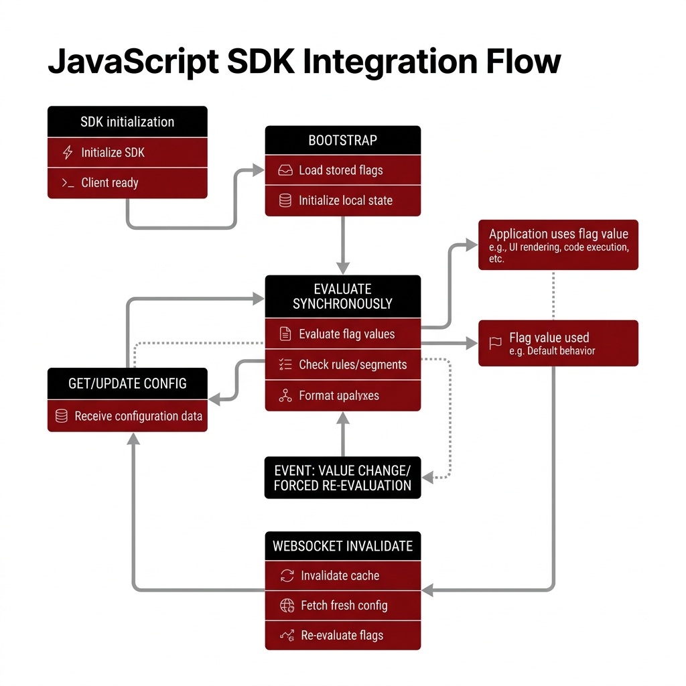

# Guía Visual y Resumen: SDK de JavaScript

A continuación se presenta la infografía técnica que resume el flujo de integración del SDK para JavaScript/TypeScript (`@backoffice/sdk-js`), junto con los pasos clave de implementación.



---

## Instalación desde GitHub

Para instalar el SDK directamente desde el repositorio de GitHub, ejecuta el comando correspondiente en tu terminal:

### Con **npm**:
```bash
npm install git+https://github.com/ianache/backoffice.git#master:sdk/sdk-js
```

### Con **pnpm**:
```bash
pnpm add git+https://github.com/ianache/backoffice.git#path:sdk/sdk-js
```

### Con **Yarn**:
```bash
yarn add https://github.com/ianache/backoffice.git#path:sdk/sdk-js
```

---

## Configuración de Endpoints (`apiBaseUrl`)

El SDK no tiene direcciones de servidor pre-configuradas (hardcodeadas). En su lugar, el servidor de feature flags y localización es localizado dinámicamente mediante el parámetro **`apiBaseUrl`** proporcionado durante la inicialización.

### 0. Cómo localiza el SDK los Endpoints del Servidor:

1. **Peticiones HTTP:** Las peticiones de sincronización se resuelven concatenando la ruta de la API a la URL base proporcionada. Por ejemplo:
   - Configuración de flags: `${apiBaseUrl}/sdk/bootstrap`
   - Configuración de labels: `${apiBaseUrl}/sdk/labels/bootstrap`
2. **Conexión WebSocket (Recarga en Caliente):** El SDK deriva la dirección de WebSockets de forma automática reemplazando el protocolo `http` por `ws` (o `https` por `wss`). Por ejemplo, si tu `apiBaseUrl` es `https://api.miproyecto.com`, se conectará automáticamente a:
   - `wss://api.miproyecto.com/sdk/ws/flags/{tenantId}`

### 1. El Parámetro de Configuración ( apiBaseUrl )

Cuando creas una instancia de client.ts o labels.ts, debes proveer una URL base (normalmente leída desde las variables
de entorno de la aplicación, como  import.meta.env.VITE_BFF_URL  o  process.env.API_URL ):

```
const client = new FeatureFlagClient({
   tenantId: 'mi-tenant',
   productId: 'mi-producto',
   environment: 'production',
   apiBaseUrl: 'https://api.miproyecto.com', // <--- Dirección del BFF o Servidor Backend
   sdkKey: 'mi-sdk-secret'
});
```

──────
### 2. Construcción Interna de Rutas en el SDK

Dentro del código del SDK, todas las peticiones HTTP se realizan de forma relativa a esa URL base concatenando los paths
específicos:

• Bootstrap de Feature Flags:  ${apiBaseUrl}/sdk/bootstrap
• Evaluación remota:  ${apiBaseUrl}/sdk/evaluate
• Telemetría:  ${apiBaseUrl}/sdk/eval-events
• Bootstrap de Localización:  ${apiBaseUrl}/sdk/labels/bootstrap

Por ejemplo, como puedes ver en la clase client.ts:

```
const url = `${this.opts.apiBaseUrl}/sdk/bootstrap?tenant_id=...`
const res = await fetch(url, { ... })
```

──────
### 3. Derivación de la URL de WebSockets

Para la recarga en tiempo real, el SDK no necesita que configures una URL de WebSockets independiente. El propio SDK deriva la
URL del socket reemplazando el protocolo  http  por  ws  (o  https  por  wss ) de manera automática:

```
const wsBaseUrl = this.opts.apiBaseUrl.replace(/^http/, 'ws');
// Se conecta automáticamente a: ws://api.miproyecto.com/sdk/ws/flags/{tenantId}
```

---

### Flujo de Trabajo del SDK

1. **Bootstrap (Inicialización)**
   - El cliente descarga la configuración inicial de los feature flags o etiquetas desde el endpoint `/sdk/bootstrap` mediante una petición HTTP.
   - Retorna una promesa que debe ser resuelta antes de iniciar la renderización (o con un timeout fail-open).

2. **Evaluate (Evaluación síncrona)**
   - Permite evaluar las reglas de los feature flags de manera síncrona en memoria en sub-milisegundos usando `client.evaluate(flagKey, context)`.
   - Si la flag no se encuentra cargada, devuelve `false` de forma segura.

3. **WebSocket Invalidation (Actualizaciones en tiempo real)**
   - Establece una conexión persistente por WebSockets a `/sdk/ws/flags/{tenantId}`.
   - Cuando se edita una regla o traducción en el panel, se recibe un evento de invalidación que descarga el namespace modificado en segundo plano sin interrumpir la experiencia del usuario.

4. **Telemetry (Métricas de uso)**
   - Registra de forma automática y en lotes las evaluaciones realizadas, subiendo la telemetría al BFF mediante un buffer asíncrono optimizado.

