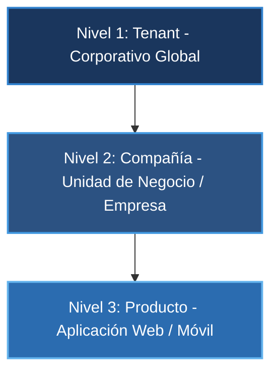
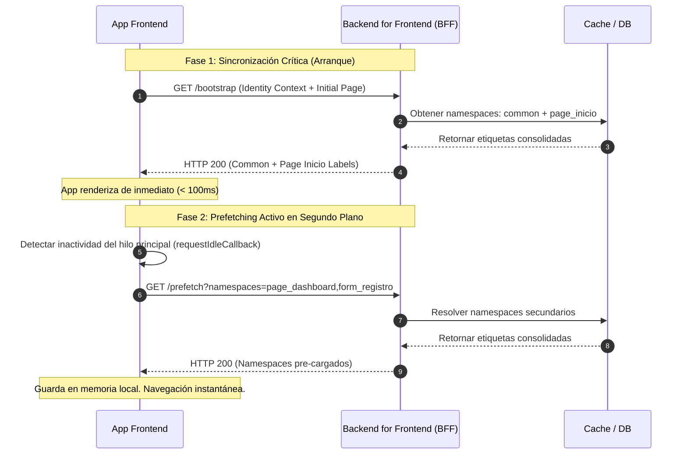
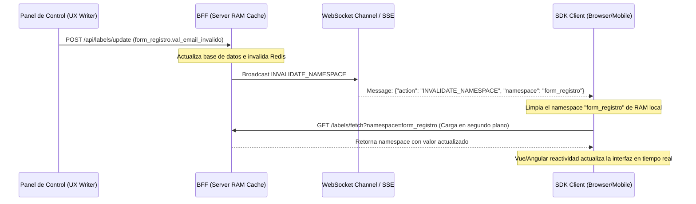

# Arquitectura Conceptual del Motor de Etiquetado Multiidioma (White Labeling Engine)

Este documento detalla la ingeniería y el diseño conceptual para la implementación de un motor de etiquetado multiidioma empresarial, optimizado para entornos multi-tenant y multi-compañía con requerimientos de marca blanca (White Labeling).

---

## 1. Modelo de Datos y Árbol de Herencia (Taxonomía Enterprise)

La resolución de etiquetas no se realiza mediante consultas a archivos planos estáticos. En su lugar, el sistema evalúa dinámicamente un **Grafo de Herencia Acíclico Dirigido (DAG)** estructurado en tres niveles jerárquicos de resolución, donde el nivel inferior hereda y sobrescribe al superior.

### Jerarquía de Configuración



### Regla de Resolución: "Sobrescritura por Cercanía"
Cuando un cliente solicita una etiqueta, el SDK del BFF evalúa el grafo de la siguiente forma:

```
[Producto] ──(Si no existe)──> [Compañía] ──(Si no existe)──> [Tenant] ──(Si no existe)──> [Technical ID Fallback]
```

A nivel de base de datos, estructuraremos las etiquetas en una tabla relacional normalizada para permitir indexación rápida y consultas selectivas por namespace y locale.

```sql
CREATE TABLE localized_labels (
    id VARCHAR(36) PRIMARY KEY,
    tenant_id VARCHAR(50) NOT NULL,
    company_id VARCHAR(50) NULL,      -- NULL si es a nivel Tenant global
    product_id VARCHAR(50) NULL,      -- NULL si es a nivel Compañía o Tenant global
    namespace VARCHAR(100) NOT NULL,  -- ej. 'common', 'page_dashboard', 'form_registro'
    locale VARCHAR(10) NOT NULL,      -- ej. 'es_PE', 'en_US'
    label_key VARCHAR(150) NOT NULL,  -- ej. 'lbl_documento_identidad'
    label_value TEXT NOT NULL,
    version INT DEFAULT 1 NOT NULL,
    created_at TIMESTAMP DEFAULT CURRENT_TIMESTAMP,
    updated_at TIMESTAMP DEFAULT CURRENT_TIMESTAMP ON UPDATE CURRENT_TIMESTAMP,
    
    UNIQUE KEY uq_label_hierarchy (tenant_id, company_id, product_id, namespace, locale, label_key),
    INDEX idx_resolver (tenant_id, company_id, product_id, namespace, locale)
);
```

> [!IMPORTANT]
> Los campos `company_id` y `product_id` son nulables. Esto permite almacenar una etiqueta base a nivel Tenant y sobrescribirla selectivamente para una Compañía o un Producto específico.

---

## 2. Organización por Namespaces

Para evitar la transferencia innecesaria de datos (especialmente en conexiones móviles lentas), los mensajes se segmentan en namespaces de carga diferida (Lazy Loading):

| Namespace | Tipo de Carga | Descripción | Ejemplos de Claves |
| :--- | :--- | :--- | :--- |
| **`common`** | Crítica / Eager | Textos transversales del sistema cargados al iniciar la app. | Navigation headers, footers, botones como "Aceptar", "Cancelar". |
| **`page_*`** | Diferida / Lazy | Textos específicos de una vista o pantalla completa. | `page_dashboard.welcome_msg`, `page_profile.title_edit`. |
| **`form_*`** | Diferida / Lazy | Controles, validaciones, placeholders y mensajes de error específicos de formularios. | `form_registro.val_email_invalido`, `form_registro.plh_cvv`. |

### Estructura de Payload JSON (Namespace `form_registro`)
```json
{
  "namespace": "form_registro",
  "locale": "es_PE",
  "labels": {
    "lbl_documento_identidad": "Documento de Identidad",
    "plh_documento_identidad": "Ingrese su número de documento",
    "val_min_characters": "El campo debe tener al menos {min} caracteres",
    "val_email_invalido": "El correo ingresado no pertenece a una empresa autorizada"
  }
}
```

---

## 3. El Contexto de Evaluación en el BFF

Cuando un usuario inicia sesión, el cliente web o móvil envía un payload mínimo de identidad al BFF. El BFF enriquece este payload para construir el **Contexto de Resolución**:

```json
{
  "identity": {
    "tenant_id": "corp_intercorp",
    "company_id": "comp_interbank",
    "product_id": "prod_banca_movil_flutter",
    "user_id": "usr_99823"
  },
  "preferences": {
    "locale": "es_PE",
    "theme": "dark"
  },
  "profile": {
    "role": "VIP_CUSTOMER",
    "segment": "banca_premium"
  }
}
```

### Algoritmo de Resolución en el BFF (Python)
Este fragmento de código ilustra cómo el Server-Side SDK en el BFF consolida las etiquetas aplicando la regla de *Sobrescritura por Cercanía*:

```python
from typing import Dict, Any, Optional
import redis

# Inicialización del cliente de caché en memoria RAM (Redis)
cache_client = redis.Redis(host='localhost', port=6379, db=0)

def resolve_labels(
    tenant_id: str,
    company_id: str,
    product_id: str,
    namespace: str,
    locale: str
) -> Dict[str, str]:
    """
    Resuelve el set de etiquetas consolidadas aplicando el principio de herencia.
    Nivel 1 (Tenant) -> Nivel 2 (Company) -> Nivel 3 (Product)
    """
    cache_key = f"labels:resolved:{tenant_id}:{company_id}:{product_id}:{namespace}:{locale}"
    
    # Intentar obtener de la caché en RAM
    cached_data = cache_client.get(cache_key)
    if cached_data:
        import json
        return json.loads(cached_data)

    # 1. Obtener etiquetas del Tenant (Nivel 1 - Base Global)
    tenant_labels = db_fetch_labels(tenant_id=tenant_id, company_id=None, product_id=None, namespace=namespace, locale=locale)
    
    # 2. Obtener etiquetas de la Compañía (Nivel 2 - Sobrescritura de Marca)
    company_labels = db_fetch_labels(tenant_id=tenant_id, company_id=company_id, product_id=None, namespace=namespace, locale=locale)
    
    # 3. Obtener etiquetas del Producto (Nivel 3 - Quirúrgica de App)
    product_labels = db_fetch_labels(tenant_id=tenant_id, company_id=company_id, product_id=product_id, namespace=namespace, locale=locale)

    # Consolidación por orden de prioridad (Cercanía)
    resolved: Dict[str, str] = {}
    resolved.update(tenant_labels)   # Prioridad baja
    resolved.update(company_labels)  # Prioridad media (sobrescribe tenant)
    resolved.update(product_labels)  # Prioridad alta (sobrescribe company y tenant)

    # Guardar en caché con expiración corta o invalidación reactiva
    cache_client.setex(cache_key, 3600, json.dumps(resolved))
    
    return resolved

def db_fetch_labels(tenant_id: str, company_id: Optional[str], product_id: Optional[str], namespace: str, locale: str) -> Dict[str, str]:
    # Consulta simulada a la BD filtrando por jerarquía exacta
    # SELECT label_key, label_value FROM localized_labels WHERE ...
    return {}
```

---

## 4. Estrategia de Carga en Dos Fases (Hydration Strategy)

Para maximizar la experiencia del usuario y lograr un arranque instantáneo (inferior a 100ms), implementamos un flujo de carga de dos fases controlado por el SDK de cliente.



---

## 5. Integración del SDK en Clientes Frontend

### A. Vue 3 (Composables y Directivas Reactivas)
En Vue 3, exponemos un plugin global que implementa el pipe `$t` con reactividad ante invalidación de caché local, además de interpolación de variables utilizando sintaxis de llaves.

```typescript
import { inject, ref, type App } from 'vue'

const labelCache = ref<Record<string, Record<string, string>>>({})

export const LabelPlugin = {
  install(app: App) {
    app.config.globalProperties.$t = (path: string, variables?: Record<string, any>): string => {
      const [namespace, key] = path.split('.')
      if (!namespace || !key) return path

      const nsLabels = labelCache.value[namespace]
      let label = nsLabels ? nsLabels[key] : null

      if (!label) {
        // Alerta al panel del administrador de etiquetas sobre la llave faltante
        reportMissingLabel(namespace, key)
        return `[sys.${key}]` // Fallback técnico
      }

      // Interpolación de variables
      if (variables) {
        Object.entries(variables).forEach(([k, v]) => {
          label = label!.replace(new RegExp(`{${k}}`, 'g'), String(v))
        })
      }

      return label
    }
  }
}

function reportMissingLabel(namespace: string, key: string) {
  // Ingesta de telemetría asíncrona hacia el BFF
  console.warn(`[LabelEngine] Missing translation for: ${namespace}.${key}`)
}
```

### B. Flutter (Soporte Offline Nativo)
En entornos móviles, la experiencia sin conexión es un requisito fundamental. El SDK de Flutter utiliza un almacenamiento de persistencia híbrido (`shared_preferences` + RAM Cache) y expone un widget declarativo.

```dart
import 'package:flutter/material.dart';

class LabelEngine {
  final Map<String, Map<String, String>> _localCache = {};
  
  static LabelEngine of(BuildContext context) {
    return LabelEngineProvider.of(context).engine;
  }

  String translate(String path, {String defaultValue = '', Map<String, String>? variables}) {
    final parts = path.split('.');
    if (parts.length < 2) return path;

    final namespace = parts[0];
    final key = parts[1];

    final label = _localCache[namespace]?[key] ?? defaultValue;
    
    if (label.isEmpty) {
      return 'sys.$key'; // Fallback
    }

    if (variables != null) {
      String interpolated = label;
      variables.forEach((k, v) {
        interpolated = interpolated.replaceAll('{$k}', v);
      });
      return interpolated;
    }

    return label;
  }
}

class LabelEngineProvider extends InheritedWidget {
  final LabelEngine engine;

  const LabelEngineProvider({
    Key? key,
    required this.engine,
    required Widget child,
  }) : super(key: key, child: child);

  static LabelEngineProvider of(BuildContext context) {
    final provider = context.dependOnInheritedWidgetOfExactType<LabelEngineProvider>();
    assert(provider != null, 'No LabelEngineProvider found in context');
    return provider!;
  }

  @override
  bool updateShouldNotify(LabelEngineProvider oldWidget) => true;
}
```

---

## 6. Sincronización en Caliente (Hot Reloading Eficaz)

Para evitar que los redactores de contenido (UX Writers) o los equipos de negocio tengan que solicitar a los usuarios reiniciar o recargar la aplicación para ver cambios en la redacción, implementamos un canal de invalidación selectiva por SSE (Server-Sent Events) o WebSockets.



### Protocolo de Mensajería del WebSocket (SDK Client Listener)
El SDK mantiene la conexión activa y reacciona de forma granular:

```typescript
class LabelWebSocketListener {
  private ws!: WebSocket

  constructor(private apiBaseUrl: string, private onInvalidate: (ns: string) => void) {
    this.connect()
  }

  private connect() {
    this.ws = new WebSocket(`${this.apiBaseUrl}/labels/events`)
    
    this.ws.onmessage = (event) => {
      try {
        const payload = JSON.parse(event.data)
        if (payload.action === 'INVALIDATE_NAMESPACE') {
          console.info(`[LabelEngine] Invalidating local namespace cache: ${payload.namespace}`)
          this.onInvalidate(payload.namespace)
        }
      } catch (err) {
        console.error('[LabelEngine] Error processing websocket message', err)
      }
    }

    this.ws.onclose = () => {
      // Re-conexión exponencial con jitter
      setTimeout(() => this.connect(), 5000)
    }
  }
}
```

---

## 7. Plan de Verificación de Escenarios

Para garantizar la robustez del motor, se definen los siguientes casos de prueba conceptuales:

### Tabla de Casos de Verificación

| ID Caso | Escenario | Contexto de Identidad | Namespace / Llave Solicitada | Resultado Esperado | Nivel Resolutor |
| :--- | :--- | :--- | :--- | :--- | :--- |
| **TC-01** | Sin sobrescrituras específicas | Tenant: `corp_intercorp`, Company: `comp_interbank`, Product: `prod_banca_movil` | `common.btn_aceptar` | "Aceptar" (Definido globalmente en Tenant) | Tenant (Global) |
| **TC-02** | Sobrescritura por Compañía | Tenant: `corp_intercorp`, Company: `comp_interbank`, Product: `prod_banca_movil` | `common.lbl_soporte` | "Soporte Interbank" (Sobrescribe "Soporte Corporativo") | Compañía (Nivel 2) |
| **TC-03** | Sobrescritura por Producto | Tenant: `corp_intercorp`, Company: `comp_interbank`, Product: `prod_banca_movil` | `form_registro.lbl_cvv` | "CVV (Reverso Tarjeta)" | Producto (Nivel 3) |
| **TC-04** | Fallback de Llave Inexistente | Tenant: `corp_intercorp`, Company: `comp_interbank`, Product: `prod_banca_movil` | `page_perfil.lbl_nonexistent` | `[sys.lbl_nonexistent]` | Fallback Técnico |
| **TC-05** | Interpolación Dinámica | N/A | `form_registro.val_min_characters` con `{min: 8}` | "El campo debe tener al menos 8 caracteres" | Client Interpolator |
| **TC-06** | Invalidación Selectiva (SSE) | Conexión WebSocket activa | Invalidate `form_registro` | Recarga asíncrona del namespace, la interfaz se refresca automáticamente | Hot Reloading |
